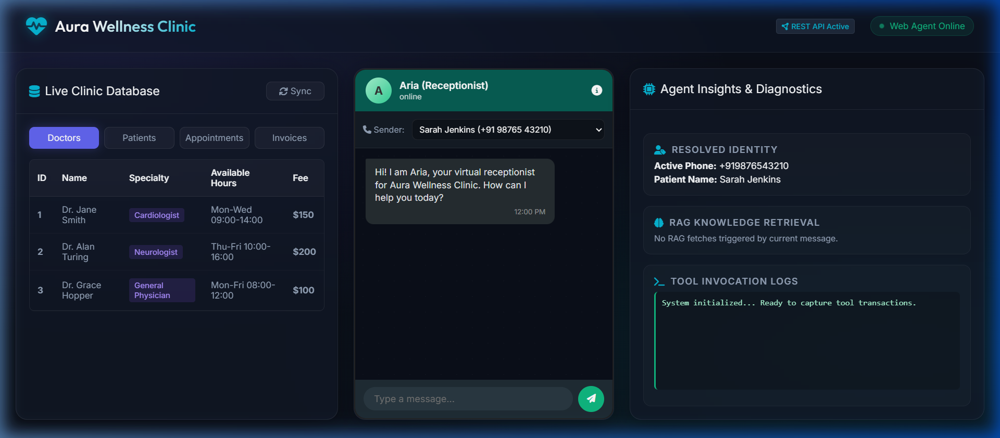
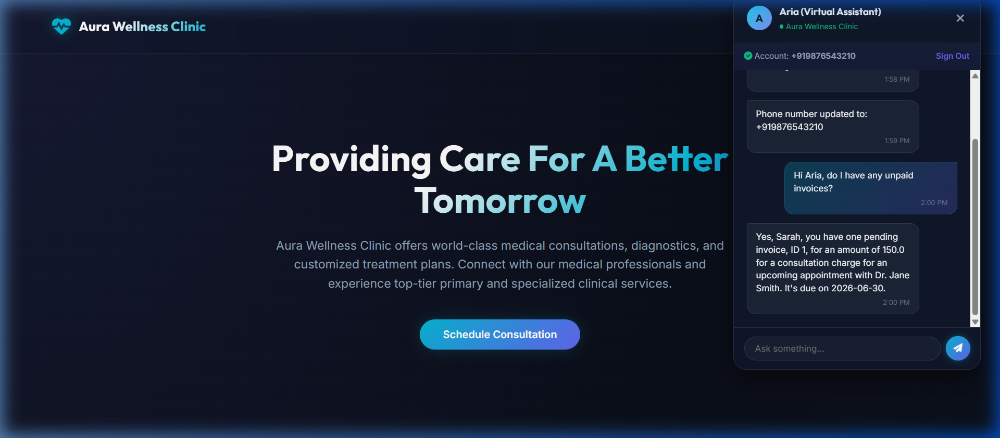
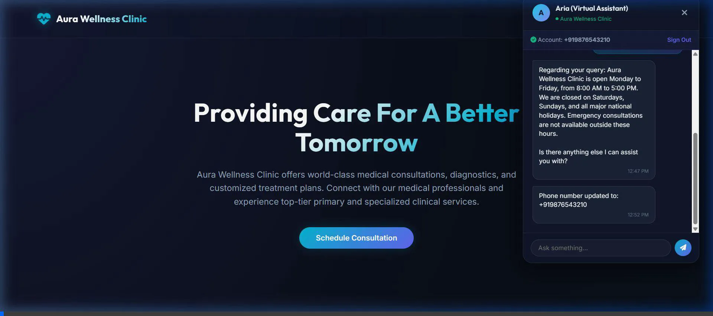

# Clinic Receptionist Agent

An AI-driven virtual receptionist ("Aria") designed for Aura Wellness Clinic. This system automates scheduling, billing inquiries, and basic account management via a browser-embedded chat widget, while using strict guardrail rules to handle out-of-scope queries and ensure patient safety.

---

## Showcase & Demos

### 1. Interactive Playground Simulator
The playground simulator features a live SQLite database viewer, raw tool transaction logs, and diagnostic dashboards side-by-side with the chat.

| Screenshot | Interactive Session Video |
|---|---|
|  |  |

### 2. Website Embedded Chat Widget
The responsive floating chat widget overlay embedded on the main clinic website.

| Screenshot | Interactive Session Video |
|---|---|
|  |  |

---

## Features

- **Patient Registration & Profiling**: Automatically looks up existing profiles by sender's phone number or guides new patients through registration.
- **Doctor Directory**: Lists available medical experts, their specialties, consultation fees, and available hours.
- **Appointment Scheduling**: Handles booking, rescheduling, and cancellation of clinic appointments.
- **Billing & Payments**: Retrieves invoice histories and simulates secure invoice payments.
- **RAG-based Knowledge Base**: Answers general clinic queries, location questions, and policies using semantic similarity RAG lookup (falling back to keyword search when API is unavailable).
- **Safety Screen Guardrails**: A lightweight moderation filter blocks profanity, gibberish, or prompt injection attacks before sending to the LLM.
- **Human Escalation**: Automatically redirects out-of-scope queries (e.g., medical advice, symptoms, personal remarks) to a human receptionist.

---

## Tech Stack

- **Backend**: FastAPI, SQLite (via SQLAlchemy), Pydantic
- **LLM/AI Engine**: Google Generative AI (Gemini SDK)
- **Frontend**: HTML5, CSS3 (Vanilla), JavaScript (Widget drawer & Playground Simulator)
- **Testing**: Pytest

---

## Directory Structure

```text
├── app/
│   ├── agent/
│   │   ├── __init__.py
│   │   ├── agent.py          # Conversational agent & guardrail engine logic
│   │   └── rag_store.py      # RAG document management & search logic
│   ├── db/
│   │   ├── __init__.py
│   │   ├── crud.py           # Database CRUD helper functions
│   │   ├── database.py       # SQLAlchemy engine & session configurations
│   │   ├── models.py         # SQLAlchemy database models
│   │   └── seed.py           # Initial clinic records seeding script
│   ├── frontend/
│   │   ├── app.js            # Playground simulator dashboard script
│   │   ├── clinic_website.html # Client site integration page
│   │   ├── index.html        # Interactive simulator playground page
│   │   └── widget.js         # Chat widget injection script
│   ├── main.py               # FastAPI entrypoint, middleware, & routes
│   └── schemas.py            # Pydantic validation schemas
├── database/
│   └── clinic.db             # Local SQLite database
├── tests/                    # Pytest test suite files
├── .env.example              # Sample environment variables config
├── requirements.txt          # Python dependencies
└── solution_document.md      # Detailed technical architecture document
```

---

## Setup & Installation

### 1. Prerequisites
- Python 3.10 or higher installed.

### 2. Install Dependencies
Clone the repository and install the required libraries:
```bash
pip install -r requirements.txt
```

### 3. Configure Environment Variables
Create a `.env` file in the root directory:
```env
GEMINI_API_KEY=your_gemini_api_key_here
GEMINI_MODEL=gemini-1.5-flash
```

---

## Running the Application

### 1. Start the Server
Run the FastAPI development server:
```bash
python -m uvicorn app.main:app --reload
```

### 2. Access the Applications
- **Interactive Playground Simulator**: Open `http://127.0.0.1:8000/` in your browser. This includes a live database viewer, raw tool execution logs, and diagnostic dashboards.
- **Clinic Website Demo**: Open `http://127.0.0.1:8000/clinic_website.html` to see the live chat bubble widget overlay embedded on a public website.

---

## Running Tests

Verify your setup by running the test suite:
```bash
python -m pytest
```
