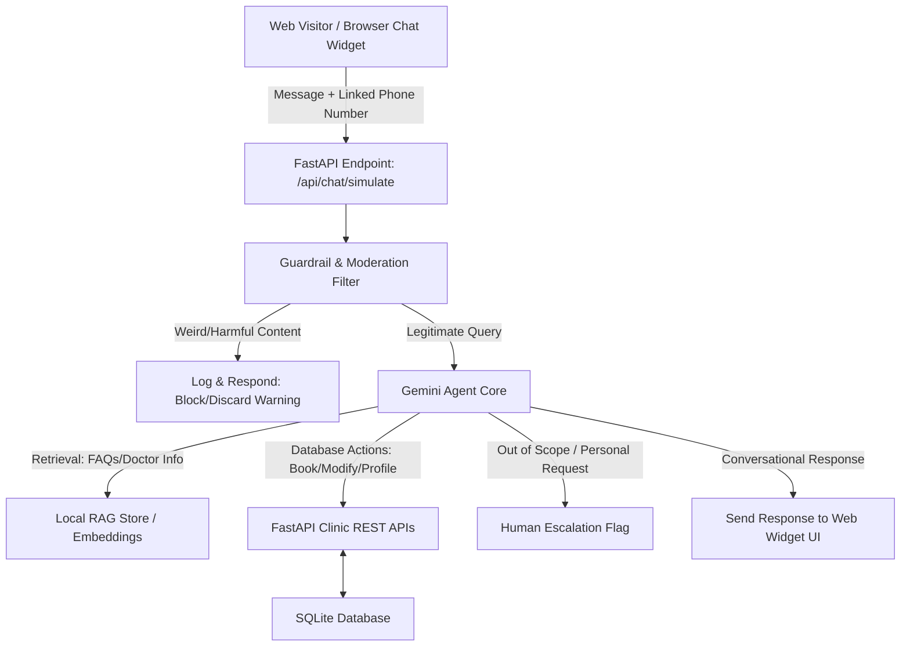
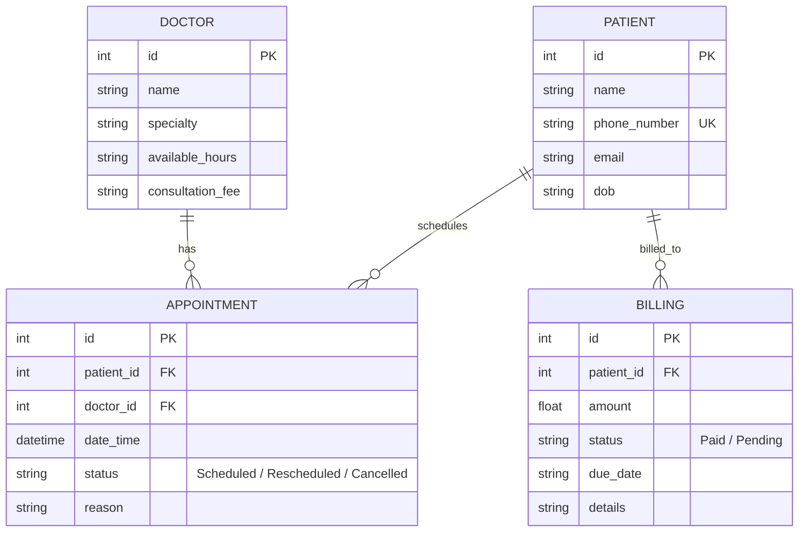

# Clinic Receptionist Agent — Solution Document

This document describes the technical solution and architecture for a **Clinic Receptionist Agent** designed for doctor clinics. The system is designed to automate scheduling, billing inquiries, and basic account management via a browser-embedded chat widget overlay, while using strict guardrails to handle out-of-scope queries and ensure patient safety.

---

## 1. System Architecture

The solution consists of three main tiers:
1. **Web Widget Overlay Layer**: Injects a floating chat bubble and slide-out chat drawer onto the clinic website. Users can link their profiles using their phone numbers.
2. **AI Agent & Guardrail Engine**: A Python-based agent utilizing Gemini AI (via `gemini-1.5-flash` or similar) with **Function Calling** (tool-use) and a **Retrieval-Augmented Generation (RAG) Database**. It validates incoming queries, checks scopes, queries information, and produces conversational responses.
3. **Clinic Backend API**: A FastAPI service connected to a SQLite database. It manages Patient Records, Doctors, Schedules, Appointments, and Billing.



---

## 2. Conversation Scope & Guardrail System

To guarantee patient confidentiality, clinic efficiency, and system safety, the agent operates under strict conversational boundaries.

### Scope Matrix

| Category | In-Scope Actions (Supported) | Out-of-Scope Actions (Escalated to Human) | Action for Weird/Malicious Input (Blocked) |
| :--- | :--- | :--- | :--- |
| **Appointments** | • Checking doctor availability<br>• Scheduling new appointments<br>• Rescheduling appointments<br>• Cancelling appointments | • Expressing medical emergencies<br>• Demanding double bookings<br>• Requesting highly custom schedules | • Vulgar or abusive language<br>• Spamming requests<br>• Prompt injection attacks |
| **User Details** | • Fetching current patient records<br>• Confirming patient phone number / name<br>• Verifying upcoming appointment history | • Modifying medical records<br>• Requesting details of other patients (data breach check) | • Impersonation attempts<br>• SQL/Prompt injection inputs |
| **Billing** | • Checking outstanding invoice status<br>• Fetching details of past bills<br>• Explaining payment terms/methods | • Disputes over billing amounts<br>• Insurance coverage details<br>• Custom discount requests | • Fraudulent receipt uploads |
| **Payments** | • Providing secure payment links<br>• Verifying payment confirmations<br>• Sending payment reminders | • Processing refunds<br>• Wire transfer verifications | • Fake transaction details |
| **Other Requests** | *None* | • Asking for medical advice/diagnosis<br>• Asking personal questions about doctors<br>• General chatting | • Irrelevant/Weird conversational queries |

### Policy Implementation

1. **Patient Identification**:
   Every incoming request contains the sender's phone number. The agent resolves this number against the database to fetch the Patient profile. If not found, it politely guides them through a registration workflow.
2. **Weird & Unacceptable Filter**:
   Before sending the query to the LLM, a lightweight moderation filter inspects the message. If it contains profanity, gibberish, prompt injection techniques (e.g., "ignore previous instructions"), or extreme off-topic text, the system discards the query, logs it, and returns a pre-configured response: *"We could not process this request. Please send a valid appointment or billing inquiry."*
3. **Out-of-Scope Detection & Human Escalation**:
   If the LLM determines that the user is asking for medical advice, personal interactions, or actions beyond scheduling and billing, it triggers the `escalate_to_human` tool. The session is flagged, and the message is forwarded to a human receptionist dashboard.

---

## 3. RAG Database Design

The Retrieval-Augmented Generation (RAG) system stores clinic policies, doctor descriptions, specialized services, and general FAQs. This allows the LLM to provide accurate answers without hardcoding clinic policies in the system prompt.

### RAG Collections & Schema
A SQLite table `rag_documents` serves as a local metadata and text store, queried using a semantic similarity check (e.g. Gemini embedding models) or fallback token matching.

| Fields | Type | Description |
| :--- | :--- | :--- |
| `id` | Integer (PK) | Unique identifier |
| `category` | String | e.g., "Doctor Profile", "Clinic Policy", "Billing FAQ" |
| `title` | String | Name of the document / FAQ question |
| `content` | Text | Detailed content block used for prompt injection |
| `keywords` | String | Comma-separated list for fallback keyword search |

---

## 4. Clinic Backend REST API Specification

A dummy backend is built in Python (using FastAPI) to manage clinic entities and act as the single source of truth for the Agent.

### Database Schema (SQLite)



### Endpoints (REST API)

#### Patients
- `GET /api/patients/by-phone/{phone_number}`
  - Fetches the patient details using the phone number from the Web Widget.
  - *Response*: Patient details or 404.
- `POST /api/patients`
  - Registers a new patient.
  - *Payload*: Name, phone number, email, DOB.

#### Doctors
- `GET /api/doctors`
  - Retrieves lists of doctors, their specialties, and fees.
- `GET /api/doctors/{id}/availability`
  - Fetches open slots for a specific doctor.

#### Appointments
- `POST /api/appointments`
  - Books a new appointment.
  - *Payload*: `patient_id`, `doctor_id`, `date_time`, `reason`.
- `PUT /api/appointments/{id}/reschedule`
  - Reschedules an appointment to a new date/time.
  - *Payload*: `new_date_time`.
- `PUT /api/appointments/{id}/cancel`
  - Cancels an appointment.
  - *Payload*: None.
- `GET /api/appointments/patient/{patient_id}`
  - Returns upcoming appointments for the logged-in patient.

#### Billing & Payments
- `GET /api/billing/patient/{patient_id}`
  - Returns pending invoices and payment histories.
- `POST /api/billing/{invoice_id}/pay`
  - Updates the invoice status to "Paid".

---

## 5. Conversational Agent Workflow & Prompt Engineering

The agent leverages **Gemini Function Calling (Tools)** to interface directly with the database via Python endpoints.

### Prompts & Directives
The system prompt establishes the persona of "Aria", the virtual receptionist for *Aura Wellness Clinic*. It enforces:
1. **Persona**: Empathetic, direct, and concise (ideal for chat interfaces).
2. **Access Control**: Before taking any action, the agent must check if a patient profile exists for the phone number.
3. **Scope Enforcement**: If the prompt is outside the permitted scope, Aria must call `escalate_to_human_receptionist` and inform the patient: *"I am connecting you with our human receptionist to help you with this specific request."*
4. **Validation**: Date/time selections must fall within the doctor's available hours.

### Tool Definitions (JSON Schema)
The agent is supplied with the following python-registered functions:
- `get_patient_profile(phone: str)`
- `register_patient(name: str, phone: str, email: str, dob: str)`
- `list_doctors()`
- `get_doctor_availability(doctor_id: int)`
- `book_appointment(patient_id: int, doctor_id: int, date_time: str, reason: str)`
- `reschedule_appointment(appointment_id: int, new_date_time: str)`
- `cancel_appointment(appointment_id: int)`
- `get_patient_billing(patient_id: int)`
- `pay_invoice(invoice_id: int)`
- `escalate_to_human_receptionist(reason: str)`
- `search_clinic_info(query: str)` (RAG interface)

---

## 6. Integrating the Clinic Receptionist Agent Widget (Production Guide)

To transition from the local simulated environment to a real production clinic website, follow this integration process:

### 1. Host the Widget Script
1. Deploy `widget.js` to a CDN, an AWS S3 bucket, or serve it directly from your production backend static directory (e.g., `https://api.aurawellnessclinic.com/static/widget.js`).
2. Make sure the script file is served over **HTTPS** to ensure transport-layer security.

### 2. Configure Cross-Origin Resource Sharing (CORS) in Backend
In production, restrict CORS access to the specific domain(s) hosting the clinic website (instead of `*` wildcard).
Update `app/main.py` middleware:
```python
app.add_middleware(
    CORSMiddleware,
    allow_origins=[
        "https://www.aurawellnessclinic.com",
        "https://aurawellnessclinic.com"
    ],
    allow_credentials=True,
    allow_methods=["POST", "GET"],
    allow_headers=["*"],
)
```

### 3. Embed the Script Tag on the Clinic Website
Add the following HTML snippet right before the closing `</body>` tag on any page of the clinic website:
```html
<script 
  src="https://api.aurawellnessclinic.com/static/widget.js" 
  data-api-url="https://api.aurawellnessclinic.com">
</script>
```

### 4. Patient Verification & Security (OTP Workflow)
Since any browser visitor can input a phone number, implement a secure One-Time Password (OTP) validation workflow before linking the user profile:
1. **Request OTP**: When the user enters their phone number in the widget, the frontend calls a `/api/auth/send-otp` endpoint.
2. **Send SMS**: The backend generates a 6-digit code, stores it temporarily (in Redis or DB), and sends it to the user's phone via an SMS gateway (e.g., Twilio).
3. **Verify OTP**: The user enters the code in the widget, which calls `/api/auth/verify-otp`. If correct, a secure session token (JWT) is returned and stored in the browser's `sessionStorage`.
4. **Authorized Requests**: The widget attaches the token to subsequent request headers, ensuring only authenticated users can view, book, reschedule, or cancel appointments.

### 5. Production Server Deployment
Run the FastAPI application under an ASGI server (like Gunicorn with Uvicorn workers) behind a reverse proxy (Nginx or Cloudflare) handling SSL certificates:
```bash
gunicorn app.main:app -w 4 -k uvicorn.workers.UvicornWorker --bind 0.0.0.0:8000
```
